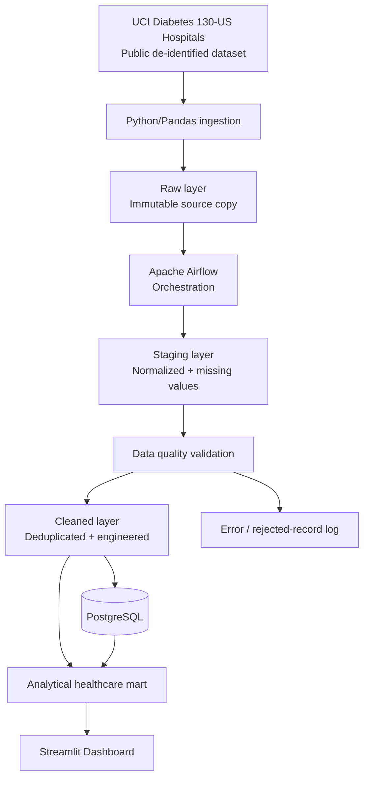

# Architecture Diagram

```mermaid
flowchart TB
    S[UCI Diabetes 130-US Hospitals\nPublic de-identified dataset]
    I[Python/Pandas ingestion]
    R[Raw layer\nImmutable source copy]
    A[Apache Airflow\nOrchestration]
    ST[Staging layer\nNormalized + missing values]
    V[Data quality validation]
    C[Cleaned layer\nDeduplicated + engineered]
    E[Error / rejected-record log]
    P[(PostgreSQL)]
    M[Analytical healthcare mart]
    D[Streamlit Dashboard]

    S --> I --> R --> A --> ST --> V
    V --> C --> P
    V --> E
    C --> M
    P --> M
    M --> D
```
